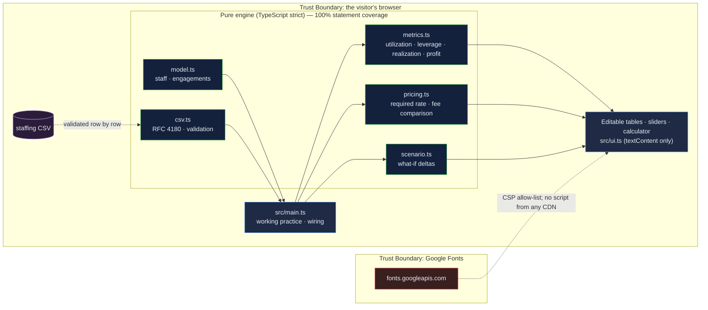

# PSF Utilization Analytics: the arithmetic a managing partner runs every month, computed from an editable staffing table

[](https://github.com/Freddricklogan/psf-utilization-analytics/actions/workflows/deploy.yml)
[](#5-getting-started--verification)
[](https://github.com/Freddricklogan/psf-utilization-analytics/actions/workflows/codeql.yml)
[](LICENSE)
[](https://freddricklogan.github.io/psf-utilization-analytics/)

## 1. Executive Summary & Business Impact

**Problem statement.** A professional-services practice lives or dies on
four numbers — utilization, leverage, realization and rate — and most small
practices track none of them. Rates are set by looking at competitors, fixed
fees are quoted from optimistic hour estimates, and the partners discover at
year end that a full order book produced a thin margin. The economics are
simple; the failure is that nobody computes them until it is too late to
act.

**Solution & value delivered.** A browser console in which the whole
practice model is an editable table: headcount, cost rate, bill rate and
billable hours per level, plus an engagement portfolio with estimated and
actual hours. Every figure on the page — utilization, leverage, standard and
realized revenue, staff cost, margin, profit per partner, collection rate —
is computed from those rows and recomputes on every edit. A scenario panel
shows what five points of utilization or an 8% rate rise is worth. A rate
calculator prices from cost, target margin and utilization, which is the term
most rate cards forget. Built for the consulting practice I am launching; the
sample practice is illustrative.

**[→ Read the full case study](docs/CASE_STUDY.md)**

| Outcome | How this repo delivers it |
| --- | --- |
| Economics that are computed, not asserted | `summarize()` derives ten headline figures from the staffing and engagement rows; nothing on screen is typed in |
| Realization made visible | Billed ÷ standard value per engagement and across the portfolio; fixed-fee overruns shown against what T&M would have earned |
| Decisions priced before they are made | `compare()` applies a scenario and reports deltas in revenue, profit, margin and profit per partner |
| Rates that recover idle time | `requiredRate(cost, margin, utilization)` — and the margin any tested rate would actually produce |
| Your practice, not mine | Staffing CSV import with row-level validation; export back to CSV |

## 2. Demonstrated Competencies & Technical Skills

- **Systems Architecture & CS** — TypeScript in strict mode with
  `noUncheckedIndexedAccess`; five pure modules (`model`, `metrics`,
  `pricing`, `scenario`, `csv`) with no DOM dependency; a Vite build whose
  output carries no inline script or style, so a `default-src 'none'` CSP
  holds after bundling.
- **Data Science & AI** — n/a. The model is deterministic arithmetic with
  every definition stated on screen so a reader can disagree with it.
- **Cybersecurity & Compliance** — strict CSP, no CDN scripts, CSV parser
  that validates every row of untrusted input and reports rather than
  throws, all user strings rendered through `textContent`; typed ESLint,
  CodeQL and Trivy in CI.
- **EdTech & Human-Centered Design** — every input is a labelled control;
  results announce through `aria-live`; the tour applies a real scenario and
  a real pricing case rather than describing them.

## 3. System Architecture & Data Flow



## 4. Technical Highlights & Engineering Decisions

### ADR-1 — Cost is charged for available hours, revenue for billable hours

**Context.** The tempting shortcut is to compute cost on billable hours,
which makes every level look profitable. People are paid for the hours they
are available, whether or not a client pays for them.

**Decision.** `staffCost()` multiplies cost rate by *available* hours;
`standardRevenue()` multiplies bill rate by *billable* hours. The gap is
utilization, and it is why the required-rate formula divides cost by
utilization before applying the margin.

**Consequence.** The sample partner level shows at 58% utilization with a
2.0× multiple and a cost above its revenue — which is the true picture for
partners who sell rather than bill, and the reason leverage matters.

### ADR-2 — Realization from the engagement portfolio, applied to the staff model

**Context.** Two sources of truth: a staffing table that gives standard
revenue, and engagements that show what was actually billed against the
hours worked. Reconciling them properly needs a time-and-billing system.

**Decision.** Compute realization from the engagements (billed ÷ standard
value) and apply it to standard revenue from the staffing table. State the
simplification on screen.

**Consequence.** One number ties the two tables together and it is the
number practices most often ignore; the label makes the approximation
explicit rather than hidden in a formula.

### ADR-3 — Vite + TypeScript, with a CSP that survives the bundle

**Context.** This is the first repository in the portfolio built with a
bundler. A bundle that injects inline scripts would force `'unsafe-inline'`
and undo the security posture of the static demos.

**Decision.** Vite with `modulePreload.polyfill` bundled into the entry
chunk, CSS imported from `main.ts` so it is emitted as a linked stylesheet,
and `base` set to the Pages path. The built `index.html` is checked for
inline script and style in the smoke test.

**Consequence.** `script-src 'self'` holds in production; the build output
is two hashed assets and an HTML file with no inline code.

## 5. Getting Started & Verification

**Prerequisites.** Node 22 LTS.

```bash
git clone https://github.com/Freddricklogan/psf-utilization-analytics.git
cd psf-utilization-analytics
npm install
npm run dev        # http://localhost:5173/psf-utilization-analytics/
npm run build && npm run preview
```

**Verification — the numbers this repository actually produced:**

```bash
npm test         # Test Files 4 passed (4) · Tests 29 passed (29)
npm run coverage # All files 100% statements · 97.12% branches
npm run lint     # eslint (typed) + tsc --noEmit — clean
npm run validate # html-validate index.html — clean
npm run build    # dist: index.html 7.9 kB · one CSS · one JS chunk (8.6 kB gzip)
```

| Check | Result |
| --- | --- |
| Unit tests | **29 passed / 29** across 4 files |
| Statement coverage (engine) | **100%** (branches 97.12%) |
| ESLint (type-checked) + `tsc --noEmit` | clean |
| html-validate | clean |
| Build output | no inline `<script>` or `style=` in `dist/index.html` |
| Headless Chrome smoke (built site) | **0 console errors**; tour step 4 shows +5 pts utilization → +$405,192 realized revenue and +$202,596 profit per partner on the sample; step 5 gives a $187/h required rate at $95 cost, 35% margin, 78% utilization; editing senior billable hours 1,420 → 1,600 moves utilization 77.1% → 79.6%; no horizontal scroll at 400 px |

Coverage is measured over the pure modules; `src/main.ts`, `src/ui.ts` and
the shell are binding layers covered by the browser smoke test.

## 6. Live Demo & Production Showcase

**<https://freddricklogan.github.io/psf-utilization-analytics/>**

No account, no backend. Sample data, labelled as such.

**30-second guided walkthrough.** Press **Take the 30-second tour**.

1. **The staffing table drives everything** — resets the sample; every
   number on the page comes from these rows.
2. **Realization, not just rates** — standard versus realized revenue, and
   profit per partner.
3. **Fixed fees carry the overrun** — two fixed-fee engagements over
   estimate, priced against T&M.
4. **What five points of utilization is worth** — applies the scenario and
   shows the deltas.
5. **Price from cost, margin and utilization** — the rate calculator on a
   worked case.

Then edit any cell in the staffing table, drag the scenario sliders, or
import your own staffing CSV.
